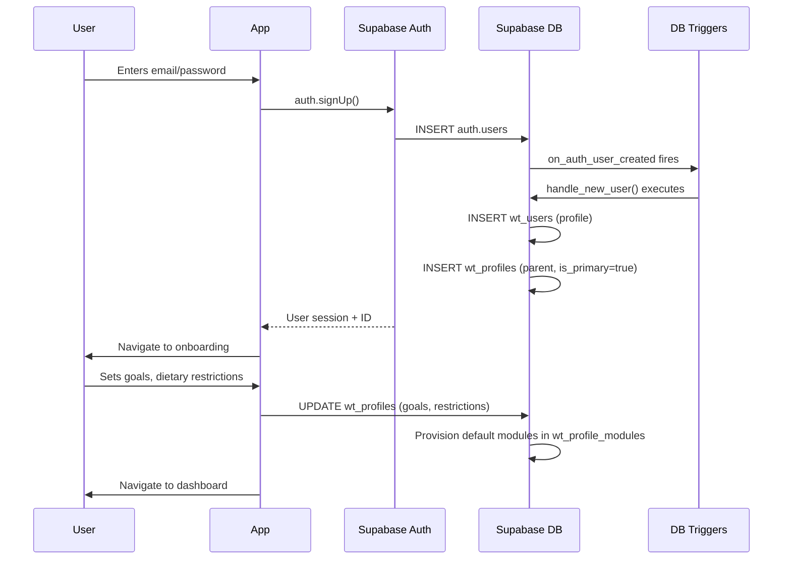
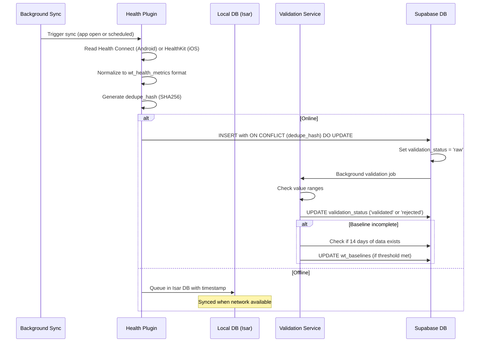
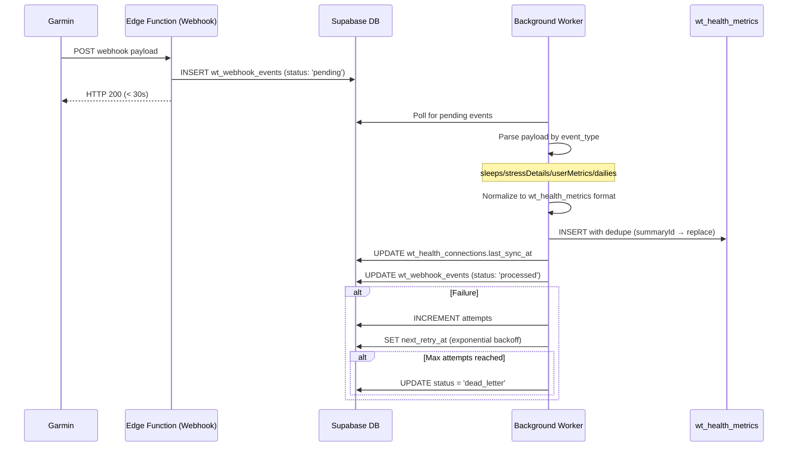
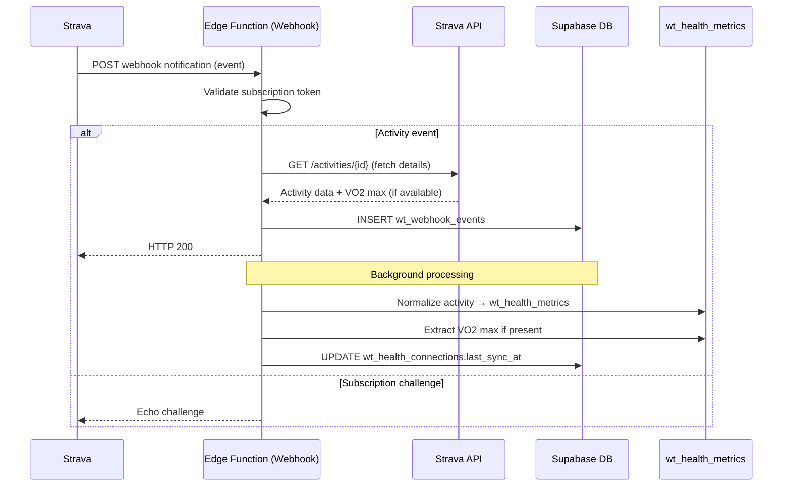
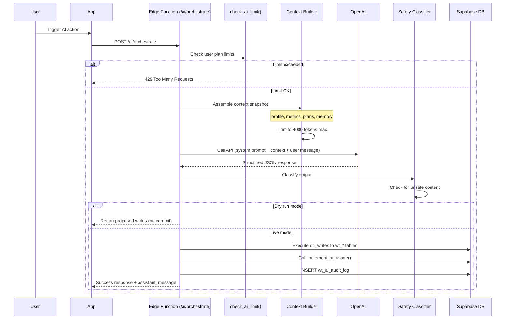
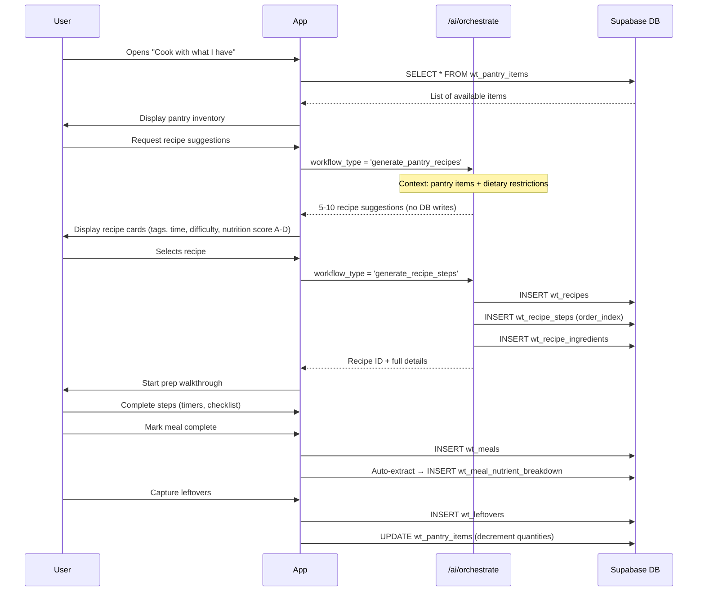
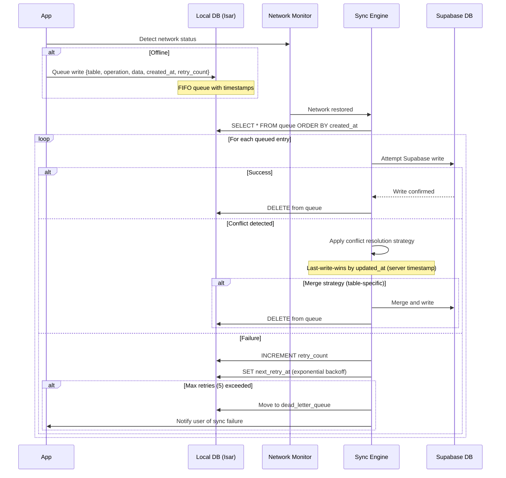
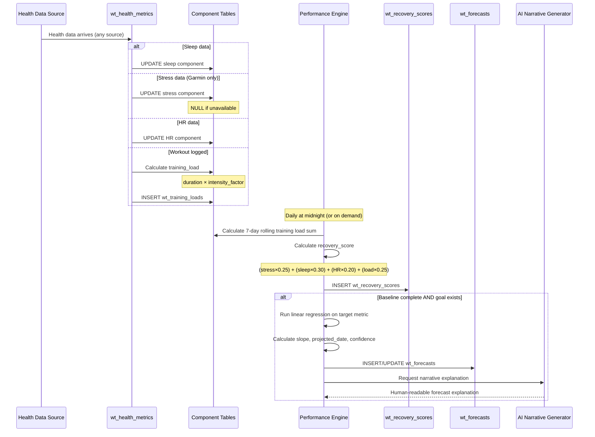
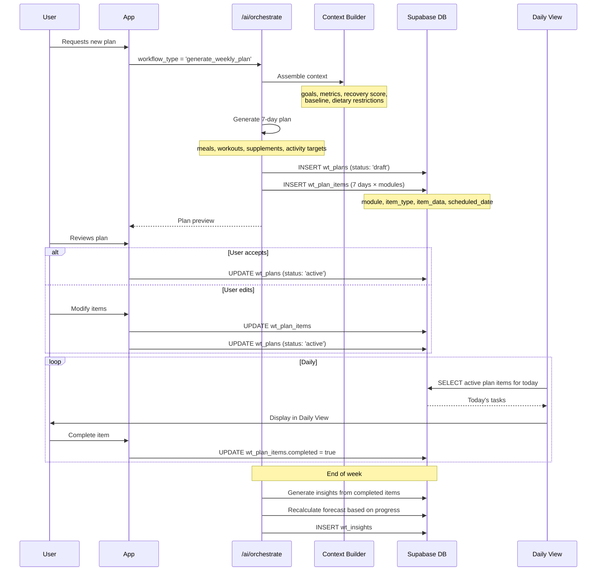

# WellTrack Event Flow Diagram

This document maps how data moves through the WellTrack system across all major workflows. Each flow shows the complete path from user action or external trigger through data validation, storage, and processing.

---

## Flow 1: User Signup & Onboarding



**Key Points:**
- Auth trigger creates both `wt_users` and parent `wt_profiles` row automatically
- Primary profile flag (`is_primary=true`) set for parent account
- Default module provisioning happens during profile update
- All operations atomic within trigger function

**Tables Touched:**
- `auth.users` (Supabase managed)
- `wt_users`
- `wt_profiles`
- `wt_profile_modules`

---

## Flow 2: Health Data Ingestion (Native — Health Connect/HealthKit)



**Data Flow:**
1. **Collection**: Platform-specific health API read
2. **Normalization**: Convert to standard format
3. **Deduplication**: Hash-based conflict prevention
4. **Validation**: Async range checking
5. **Baseline Tracking**: 14-day rolling window

**Dedupe Hash Components:**
- `user_id + profile_id + source + metric_type + start_time + end_time`

**Tables Touched:**
- `wt_health_metrics`
- `wt_baselines` (conditional)

---

## Flow 3: Garmin Webhook Push (Phase 7)



**Event Types & Mapping:**
- `sleeps` → sleep duration, stages, score
- `stressDetails` → stress score (0-100)
- `userMetrics` → VO2 max, fitness age
- `dailies` → steps, calories, HR zones

**Retry Strategy:**
- Attempt 1: Immediate
- Attempt 2: +5 minutes
- Attempt 3: +30 minutes
- Attempt 4: +2 hours
- Attempt 5: +6 hours
- After 5: Dead letter queue

**Tables Touched:**
- `wt_webhook_events`
- `wt_health_metrics`
- `wt_health_connections`

---

## Flow 4: Strava Webhook (Phase 7)



**Activity Data Extracted:**
- Type (run, ride, swim, etc.)
- Distance, duration, elevation
- Average HR, max HR
- VO2 max estimate (if available)
- Calories burned

**Tables Touched:**
- `wt_webhook_events`
- `wt_health_metrics`
- `wt_health_connections`

---

## Flow 5: AI Orchestrator Call



**Context Snapshot Includes:**
- User profile (goals, restrictions, preferences)
- Recent health metrics (last 14 days)
- Active plans and progress
- AI memory (preferences, patterns)
- Baseline and forecast data

**System Prompt Tone:**
- Suggestive, not prescriptive
- Evidence-based recommendations
- Respects user autonomy

**Rate Limit Checks:**
- Daily token count vs. plan limit
- Daily API calls vs. plan limit
- Reset at midnight UTC

**Tables Touched:**
- `wt_ai_usage`
- `wt_ai_audit_log`
- Various `wt_*` tables (based on workflow)

---

## Flow 6: Pantry → Recipes → Prep



**Recipe Suggestion Scoring:**
- Ingredient match percentage
- Prep + cook time
- Difficulty level
- Nutrition score (A-D based on macro balance)
- User preference alignment

**Prep Walkthrough Features:**
- Step-by-step checklist
- Built-in timers per step
- Ingredient staging prompts
- Equipment reminders

**Tables Touched:**
- `wt_pantry_items`
- `wt_recipes`
- `wt_recipe_steps`
- `wt_recipe_ingredients`
- `wt_meals`
- `wt_meal_nutrient_breakdown`
- `wt_leftovers`

---

## Flow 7: Offline Sync



**Conflict Resolution Strategies:**
- **wt_meals, wt_workouts**: Last-write-wins (server timestamp)
- **wt_health_metrics**: Dedupe hash prevents conflicts
- **wt_pantry_items**: Quantity sum (if both devices logged usage)
- **wt_profiles**: Field-level merge (preferences, goals)

**Exponential Backoff:**
- Retry 1: Immediate
- Retry 2: +30 seconds
- Retry 3: +2 minutes
- Retry 4: +10 minutes
- Retry 5: +30 minutes

**Dead Letter Queue Notification:**
- In-app alert with details
- Option to manually retry or discard
- Logging to support diagnostics

**Tables Touched:**
- All `wt_*` tables (potentially)
- Local Isar sync queue table

---

## Flow 8: Performance Engine Pipeline



**Component Normalization (0-100 scale):**
- **Stress**: Inverse (lower = better) → 100 - stress_score
- **Sleep**: Hours / target × 100
- **HR**: Resting HR inverse normalized
- **Load**: Training load / baseline × 100

**Recovery Score Formula:**
```
recovery_score =
  (stress_normalized × 0.25) +
  (sleep_normalized × 0.30) +
  (hr_normalized × 0.20) +
  (load_normalized × 0.25)
```

**Linear Regression for Forecasting:**
- Uses last 30 days of target metric
- Calculates slope (rate of improvement)
- Projects to goal target value
- Confidence based on R² value

**AI Narrative Example:**
> "Based on your current progress (0.2 kg/week average), you're on track to reach your 75 kg target by May 15, 2026. Your recovery score is trending upward, indicating good adaptation to your training load."

**Tables Touched:**
- `wt_health_metrics`
- `wt_training_loads`
- `wt_recovery_scores`
- `wt_forecasts`
- `wt_baselines`

---

## Flow 9: Plan Generation



**Plan Item Structure:**
```json
{
  "plan_id": "uuid",
  "module": "meals",
  "item_type": "breakfast",
  "item_data": {
    "recipe_id": "uuid",
    "servings": 1,
    "target_time": "08:00"
  },
  "scheduled_date": "2026-02-15",
  "completed": false
}
```

**Plan Status States:**
- `draft` — Generated but not accepted
- `active` — User accepted, in progress
- `completed` — All items done or week ended
- `archived` — Historical record

**Weekly Insights Generated:**
- Completion rate by module
- Nutrition adherence (actual vs. targets)
- Training load vs. recovery balance
- Goal progress delta
- AI suggestions for next week

**Tables Touched:**
- `wt_plans`
- `wt_plan_items`
- `wt_insights`
- `wt_forecasts`
- `wt_baselines`

---

## Cross-Cutting Concerns

### Authentication Flow
All API calls include:
```
Authorization: Bearer <supabase_access_token>
```

Row-Level Security (RLS) enforces:
```sql
-- Example policy
CREATE POLICY "Users can only access their own data"
ON wt_health_metrics
FOR ALL
USING (auth.uid() = user_id);
```

### Error Handling Pattern
```
Try operation
  → If success: return result
  → If retriable error: queue for retry
  → If permanent error: log to wt_error_log + notify user
```

### Audit Trail
All AI operations and sensitive data changes logged to:
- `wt_ai_audit_log` — AI calls, tokens used, workflow type
- `wt_audit_log` — Data modifications (who, what, when)

### Performance Monitoring
Key metrics tracked:
- API response times (p50, p95, p99)
- Database query duration
- AI token usage per user/plan
- Webhook processing latency
- Sync queue depth and retry rates

---

## Data Flow Summary

| Flow | Trigger | Source | Destination | Latency |
|------|---------|--------|-------------|---------|
| Signup | User action | App | auth.users → wt_users → wt_profiles | < 2s |
| Native Health | Background sync | Health Connect/HealthKit | wt_health_metrics | < 5s |
| Garmin Webhook | Garmin push | Garmin API | wt_webhook_events → wt_health_metrics | < 60s |
| Strava Webhook | Strava push | Strava API | wt_webhook_events → wt_health_metrics | < 60s |
| AI Orchestrator | User/scheduled | App | OpenAI → wt_* tables | 2-10s |
| Pantry → Recipe | User action | App | AI → wt_recipes | 5-15s |
| Offline Sync | Network restore | Local Isar | Supabase DB | Variable |
| Performance Engine | Daily/on-demand | wt_health_metrics | wt_recovery_scores, wt_forecasts | < 30s |
| Plan Generation | User/AI | AI | wt_plans, wt_plan_items | 10-20s |

---

## Notes for Developers

1. **Always respect offline-first**: Queue writes to local DB when network unavailable
2. **Dedupe hashes prevent duplicates**: Use consistent hash generation across sources
3. **RLS is non-negotiable**: Every table must have policies restricting to user's own data
4. **Webhooks must respond fast**: Acknowledge within 30s, process asynchronously
5. **AI context is expensive**: Trim to 4000 tokens max, prioritize recent + relevant data
6. **Conflict resolution is table-specific**: Document strategy per table in schema
7. **Baseline requires 14 days**: Don't calculate recovery scores or forecasts until baseline complete
8. **Rate limiting is server-side**: Never trust client for AI usage enforcement

---

**Document Version:** 1.0
**Last Updated:** 2026-02-15
**Maintained By:** Backend Team
